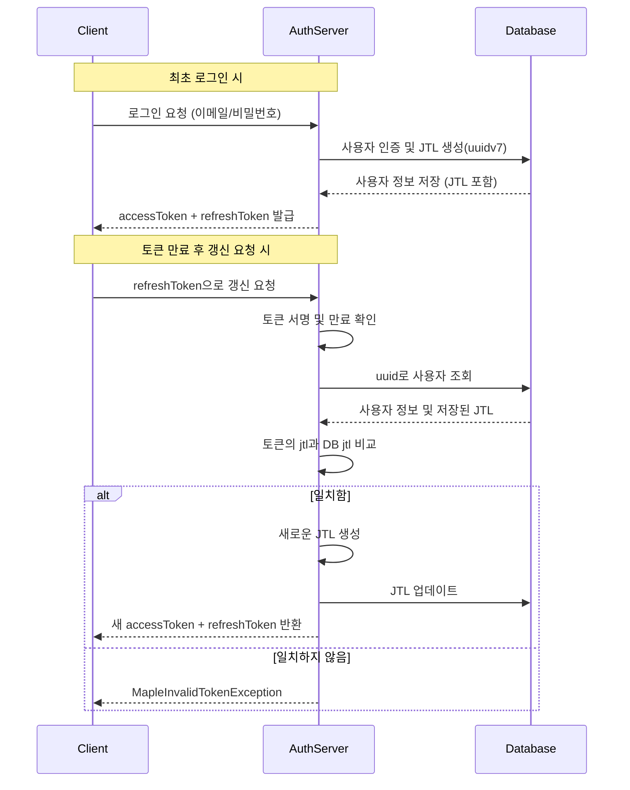

# Auth Server

이 서버는 인증 서버로 역할은 아래와 같습니다.

1. 로그인 (accessToken, refreshToken 발급)
2. 회원 가입
3. 권한 부여/삭제
4. 유저 목록 조회
5. 관리자 계정 생성
6. 관리자 권한 부여/삭제

인증 서버 특성상 실시간 응답이 중요하기 때문에 메세지 큐가 아니라 Http 프로토콜을 통해 데이터를 주고받을 수 있도록 하였습니다.

# 권한

현재의 요구사항은 매우 작은 기능만을 담고 있어 기능별 고유권한으로도 충분하지만 추후에 시스템이 확장 될 경우 단일 권한만 부여가능할 경우 매우 많은 단일 권한이 생기게 되고 관리에 어려움이 있기 때문에 유저가 여러 권한을 가질 수 있도록 하였습니다.

# 리프레시 토큰 전략

기본적으로 로그인 시 accessToken과 refreshToken을 같이 발급합니다.

refreshToken은 아래와 같은 내용으로 서명됩니다.

- 유저의 고유식별자 (uuid)
- 현재 유효한 토큰인지 식별가능한 식별자 (jtl)

## 토큰 저장 및 검증 방식

- 리프레시 토큰 생성 시 uuidv7()로 생성된 고유한 JTL(JWT ID) 값이 포함됩니다.
- 이 JTL 값은 사용자 데이터베이스 레코드에 저장됩니다.
- 리프레시 토큰이 재발급될 때마다 사용자의 JTL 값도 새로 업데이트됩니다.

## 토큰 검증 과정

- 리프레시 토큰의 서명을 먼저 검증합니다
- 서명이 유효하면 토큰 내에 포함된 유저의 고유식별자와 유효한 토큰인지 식별가능한 식별자( jtl )를 추출합니다.
- 유저의 고유식별자를 가진 유저를 DB에서 조회하여 DB에 저장된 식별자 ( jtl )과 토큰에서 추출한 식별자 ( jtl )이 일치한지 검증합니다.
- 일치하는 경우에만 새 토큰을 발급합니다.

# 유저

| 필드명    | 타입      | 필수 여부 | 고유 값 | 기본값     | 설명                                |
| --------- | --------- | --------- | ------- | ---------- | ----------------------------------- |
| uuid      | string    | ✅        | ✅      | uuidv7()   | 사용자 고유 식별자                  |
| email     | string    | ✅        | ✅      | -          | 이메일 주소                         |
| password  | string    | ✅        | ❌      | -          | 암호화된 비밀번호                   |
| roles     | Role[]    | ✅        | ❌      | -          | 사용자 역할 배열                    |
| createdAt | Date      | ✅        | ❌      | new Date() | 계정 생성 시간                      |
| updatedAt | Date      | ✅        | ❌      | new Date() | 계정 정보 업데이트 시간             |
| jtl       | string    | ❌        | ❌      | -          | JWT ID (리프레시 토큰 검증용)       |
| state     | UserState | ✅        | ❌      | ACTIVE     | 계정 상태 (ACTIVE/INACTIVE/DELETED) |

# 유저 로그인 히스토리

| 필드명     | 타입                | 필수 여부 | 고유 값 | 기본값     | 설명                                       |
| ---------- | ------------------- | --------- | ------- | ---------- | ------------------------------------------ |
| uuid       | string              | ✅        | ✅      | uuidv7()   | 로그인 이력 고유 식별자                    |
| userUuid   | string              | ❌        | ❌      | -          | 로그인한 사용자 uuid                       |
| ipv4       | string              | ❌        | ❌      | -          | IPv4 주소                                  |
| ipv6       | string              | ❌        | ❌      | -          | IPv6 주소                                  |
| success    | boolean             | ✅        | ❌      | -          | 로그인 성공 여부                           |
| failReason | LoginFailReason     | ❌        | ❌      | -          | 로그인 실패 사유 (`LOGIN_FAIL_REASON_MAP`) |
| createdAt  | Date                | ✅        | ❌      | new Date() | 로그인 시각                                |
| metadata   | Record<string, any> | ❌        | ❌      | -          | 부가 정보 (ex. userAgent 등)               |

#
