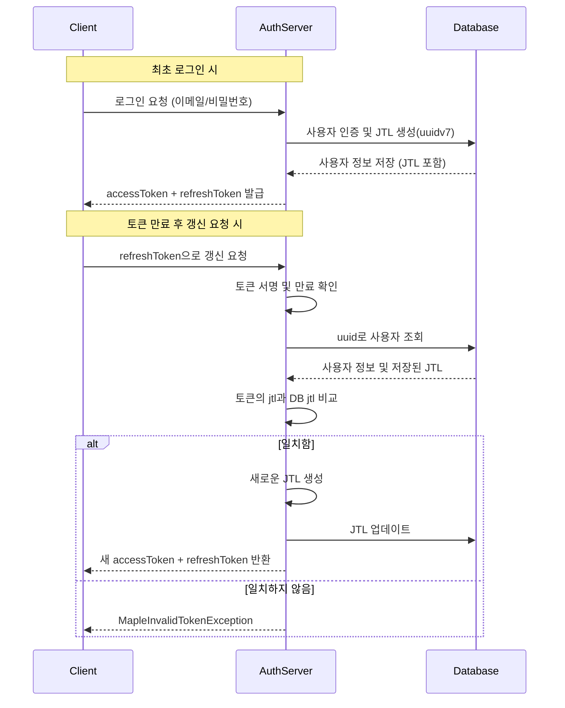

# Auth Server

이 서버는 인증 서버로 역할은 아래와 같습니다.

1. 로그인 (accessToken, refreshToken 발급)
2. 회원 가입
3. 권한 부여/삭제
4. 유저 목록 조회
5. 관리자 계정 생성
6. 관리자 권한 부여/삭제

인증 서버 특성상 실시간 응답이 중요하기 때문에 메세지 큐가 아니라 Http 프로토콜을 통해 데이터를 주고받을 수 있도록 하였습니다.

# 권한

현재의 요구사항은 매우 작은 기능만을 담고 있어 기능별 고유권한으로도 충분하지만 추후에 시스템이 확장 될 경우 단일 권한만 부여가능할 경우 매우 많은 단일 권한이 생기게 되고 관리에 어려움이 있기 때문에 유저가 여러 권한을 가질 수 있도록 하였습니다.

# 리프레시 토큰 전략

기본적으로 로그인 시 accessToken과 refreshToken을 같이 발급합니다.

refreshToken은 아래와 같은 내용으로 서명됩니다.

- 유저의 고유식별자 (uuid)
- 현재 유효한 토큰인지 식별가능한 식별자 (jtl)

## 토큰 저장 및 검증 방식

- 리프레시 토큰 생성 시 uuidv7()로 생성된 고유한 JTL(JWT ID) 값이 포함됩니다.
- 이 JTL 값은 사용자 데이터베이스 레코드에 저장됩니다.
- 리프레시 토큰이 재발급될 때마다 사용자의 JTL 값도 새로 업데이트됩니다.

## 토큰 검증 과정

- 리프레시 토큰의 서명을 먼저 검증합니다
- 서명이 유효하면 토큰 내에 포함된 유저의 고유식별자와 유효한 토큰인지 식별가능한 식별자( jtl )를 추출합니다.
- 유저의 고유식별자를 가진 유저를 DB에서 조회하여 DB에 저장된 식별자 ( jtl )과 토큰에서 추출한 식별자 ( jtl )이 일치한지 검증합니다.
- 일치하는 경우에만 새 토큰을 발급합니다.



# API Document

api는 기본적으로 아래 타입의 응답 포맷을 따릅니다

```tsx
type Response<T> = {
  code: string;
  message: string;
  data: T;
};
```

같은 상태코드여도 다른 오류 케이스로 확장될 수 있기에 Http 상태코드와 더불어 별도의 오류 코드를 정의하여 더 많은 케이스를 처리 가능하도록 설계하였습니다.

## API Endpoint

| 기능                | 메서드 | 경로                 | 권한 |
| ------------------- | ------ | -------------------- | ---- |
| 회원가입(유저 등록) | POST   | /api/v1/auth/signup  |      |
| 로그인              | POST   | /api/v1/auth/login   |      |
| 토큰 재발급         | POST   | /api/v1/auth/refresh |      |
| 유저 역할 변경      | PATCH  | /api/v1/users/role   |      |
| 유저 상태 변경      | PATCH  | /api/v1/users/state  |      |
| 유저 목록 조회      | GET    | /api/v1/users        |      |
| 관리자 계정 등록    | POST   | /api/v1/admin        |      |
| 관리자 역할 수정    | PATCH  | /api/v1/admin/role   |      |

## 공통 응답

### 정상 - 20X

```json
HTTP 20X

{
  "code": "SUCCESS",
  "message": "성공",
  "data": null
}

```

### BadRequest - 400

```json
{
  "code": "INVALID_REQUEST",
  "message": "상황에 맞는 메세지",
  "data": null
}
```

### InternalServerError - 500

```json
{
  "code": "ERROR",
  "message": "오류가 발생하였습니다.",
  "data": null
}
```

## AuthController API 문서

---

### 1. 회원가입 (Signup)

- **Method**: `POST`
- **URL**: `/api/v1/auth/signup`
- **Status Code**: `201 Created`

### ✅ Request Body

```json
{
  "email": "test@example.com",
  "password": "secure_password"
}
```

### 🟢 Response - 성공

```json
{
  "code": "SUCCESS",
  "message": "성공",
  "data": null
}
```

### 🔴 Response - 실패

- 이메일 중복
- 409 Conflict

```json
{
  "code": "CONFLICT_EMAIL",
  "message": "이미 존재하는 이메일입니다.",
  "data": null
}
```

---

### 2. 로그인 (Login)

- **Method**: `POST`
- **URL**: `/api/v1/auth/login`
- **Status Code**: `200 OK`

### ✅ Request Body

```json
{
  "email": "test@example.com",
  "password": "secure_password"
}
```

### 🟢 Response - 성공

```json
{
  "code": "SUCCESS",
  "message": "성공",
  "data": {
    "accessToken": "string",
    "refreshToken": "string"
  }
}
```

### 🔴 Response - 실패

- 이메일 또는 비밀번호 틀린 경우
- 401 Unauthorized

```json
{
  "code": "INVALID_CREDENTIAL",
  "message": "유저 정보가 일치하지 않습니다.",
  "data": null
}
```

- 비활성화 된 유저
- 401 Unauthorized

```json
{
  "code": "INACTIVE_USER",
  "message": "비활성화된 유저입니다.",
  "data": null
}
```

- 존재하지 않는 유저
- 404 NotFound

```json
{
  "code": "NOT_FOUND_USER",
  "message": "존재하지 않는 유저입니다.",
  "data": null
}
```

---

### 3. 토큰 재발급 (Refresh)

- **Method**: `POST`
- **URL**: `/api/v1/auth/refresh`
- **Status Code**: `200 OK`

### ✅ Request Body

```json
{
  "refreshToken": "string"
}
```

### 🟢 Response - 성공

- 200 OK

```json
{
  "code": "SUCCESS",
  "message": "토큰 재발금 성공",
  "data": {
    "accessToken": "string",
    "refreshToken": "string"
  }
}
```

### 🔴 Response - 실패

- 토큰이 변조되거나 JTL만료
- 401 Unauthorized

```json
{
  "code": "INVALID_TOKEN",
  "message": "유효하지 않은 토큰입니다.",
  "data": null
}
```

- 토큰이 만료됨
- 401 Unauthorized

```json
{
  "code": "TOKEN_EXPIRED",
  "message": "만료된 토큰입니다.",
  "data": null
}
```

---

# UsersController API 문서

---

### 1. 유저 역할 변경 (Update Role)

- **Method**: `PATCH`
- **URL**: `/api/v1/users/role`
- **Status Code**: `200 OK`

### ✅ Request Body

```json
{
  "uuid": "user-uuid",
  "roles": ["USER", "OPERATOR"] // ADMIN은 불가능
}
```

### 🟢 Response - 성공

- 200 OK

```json
{
  "code": "SUCCESS",
  "message": "성공"
}
```

### 🔴 Response - 실패

- 존재하지 않는 유저

```json
{
  "code": "NOT_FOUND_USER",
  "message": "존재하지 않는 유저입니다.",
  "data": null
}
```

---

### 2. 유저 목록 조회 (Find Many Users)

- **Method**: `GET`
- **URL**: `/api/v1/users`
- **Status Code**: `200 OK`

### ✅ Query Parameters

| 이름  | 타입     | 설명                    | 기본값 | 제약 조건                       |
| ----- | -------- | ----------------------- | ------ | ------------------------------- |
| page  | number   | 페이지 번호             | 1      | 최소 1                          |
| limit | number   | 한 페이지당 항목 수     | 10     | 최소 1, 최대 100                |
| roles | string[] | 쉼표로 구분된 역할 목록 | 없음   | USER, OPERATOR, AUDITOR 중 선택 |

예시: `/api/v1/users?page=2&limit=20&roles=USER,OPERATOR`

### 🟢 Response - 성공

- 200 OK

```json
{
  "code": "SUCCESS",
  "message": "성공",
  "data": {
    "users": [
      {
        "uuid": "string",
        "email": "string",
        "roles": ["USER"],
        "createdAt": "Date";
        "state": "ACTIVE"
      }
    ],
    "currentPage": 1,
    "totalPage": 1,
    "totalCount": 1
  }
}
```

---

### 3. 유저 상태 변경 (Update User State)

- **Method**: `PATCH`
- **URL**: `/api/v1/users/state`
- **Status Code**: `200 OK`

### ✅ Request Body

```json
{
  "uuid": "user-uuid",
  "state": "INACTIVE"
}
```

### 🟢 Response - 성공

- 200 OK

```json
{
  "code": "SUCCESS",
  "message": "상태 변경 성공"
  "data": null
}

```

### 🔴 Response - 실패

- 존재하지 않는 유저
- 404 NotFound

```json
{
  "code": "NOT_FOUND_USER",
  "message": "존재하지 않는 유저입니다.",
  "data": null
}
```

---

# 유저 테이블

| 필드명    | 타입      | 필수 여부 | 고유 값 | 기본값     | 설명                                |
| --------- | --------- | --------- | ------- | ---------- | ----------------------------------- |
| uuid      | string    | ✅        | ✅      | uuidv7()   | 사용자 고유 식별자                  |
| email     | string    | ✅        | ✅      | -          | 이메일 주소                         |
| password  | string    | ✅        | ❌      | -          | 암호화된 비밀번호                   |
| roles     | Role[]    | ✅        | ❌      | -          | 사용자 역할 배열                    |
| createdAt | Date      | ✅        | ❌      | new Date() | 계정 생성 시간                      |
| updatedAt | Date      | ✅        | ❌      | new Date() | 계정 정보 업데이트 시간             |
| jtl       | string    | ❌        | ❌      | -          | JWT ID (리프레시 토큰 검증용)       |
| state     | UserState | ✅        | ❌      | ACTIVE     | 계정 상태 (ACTIVE/INACTIVE/DELETED) |

# 유저 로그인 히스토리 테이블

| 필드명     | 타입                | 필수 여부 | 고유 값 | 기본값     | 설명                                       |
| ---------- | ------------------- | --------- | ------- | ---------- | ------------------------------------------ |
| uuid       | string              | ✅        | ✅      | uuidv7()   | 로그인 이력 고유 식별자                    |
| userUuid   | string              | ❌        | ❌      | -          | 로그인한 사용자 uuid                       |
| ipv4       | string              | ❌        | ❌      | -          | IPv4 주소                                  |
| ipv6       | string              | ❌        | ❌      | -          | IPv6 주소                                  |
| success    | boolean             | ✅        | ❌      | -          | 로그인 성공 여부                           |
| failReason | LoginFailReason     | ❌        | ❌      | -          | 로그인 실패 사유 (`LOGIN_FAIL_REASON_MAP`) |
| createdAt  | Date                | ✅        | ❌      | new Date() | 로그인 시각                                |
| metadata   | Record<string, any> | ❌        | ❌      | -          | 부가 정보 (ex. userAgent 등)               |

#
